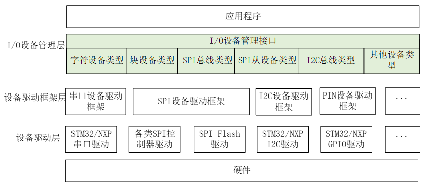

## 两轴机机械臂视频大纲

>   0.主控介绍

本次使用的开发板是由南京沁恒微电子提供的CH32V307V-R1-1v0评估板，使用的主控 MCU为CH32V307VCT6。是一款基于32位RISC-V设计的互联型微控制器，带有224K的ROM和96K的RAM。配备了硬件堆栈区、快速中断入口，在标准RISC-V基础上大大提高了中断响应速度。加入单精度浮点指令集，扩充堆栈区，具有更高的运算性能。扩展串口UART数量到8组，电机定时器到4组。提供USB2.0高速接口（480Mbps）并内置了PHY收发器，以太网MAC升级到千兆并集成了10M-PHY模块。


>   1.RT-Thread与裸机开发的区别

-   软件包与驱动

    在一般的裸机程序开发的过程中，一般来说我们需要自己写驱动，即使使用现成的驱动时，也要根据自己的程序架构添加相应的头文件，可能还需要对接IIC等接口。即使顺利的完成了驱动编写工作，对于程序的移植来说还是十分麻烦的。在RT-Thread中，整个 I/O 设备的使用被分解成为了三层结构。

    

    设备驱动层将根据不同芯片物理结构的不同进行编写，I/O 设备管理层可以提供多种接口对接不同种外设驱动的开发，通过设备驱动框架层将上下两层连接起来，可以实现软件驱动与硬件分隔开来。更换芯片时只需要重新编写设备驱动层，不同芯片使用相同外设时，无需二次开发，简单移植，一次编写，多次使用。同时RT-Thread还提供了软件包开源平台，在这里可以接触到全球开发者制作的软件包，下载部署之后，只需要简单阅读数据手册，就可以直接使用。

-   死循环与多线程

    在使用裸机开发方法的时候，一般情况下会在主函数内放置while（1），使芯片反复执行判断，任何一个函数卡住都会对后续代码造成影响。在使用RT-Thread时，完全不需要考虑这个问题，RT-Thread提供多线程开发方法，可以将不同任务依照优先级进行分配，RT-Thread将会自动进行CPU资源分配，让开发更便利。

    

-   全局变量标志与互斥量

    ```c
    void change()
    {
        if(i)
        {
            printf("1");
        }
        else
        {
            printf("0");
        }
    }
    ```

    什么是互斥量呢，互斥量其实是信号量的优化，两者主要的应用领域不同，感兴趣的同学可以访问RT-Thread官网进行了解，我本次使用的是信号量来实现互斥量的主要应用领域。信号量简单来说可以实现全局变量标志的功能。相当于创建了一个仓库，在创建时可以指定初始仓库存有几颗信号，线程可以尝试获取，也可以存入，可以指定如果没有拿到信号的时候是否等待，每次存入信号加一，每次取出信号减一。这样的操作会更加直观，符合我们的常识，而且在RT-Thread的管理之下会更加的安全，高效。

-   使用感受

    在这次浅浅的接触过程中，我在使用上感触最深的是多线程开发的方式，其次是串口控制，输入一些简单的指令，就可以查看到系统的状态，对应编写代码，可以实现线程的调试功能，通过打开调试信息输出按钮，可以观察到程序运行每一步的状态，进行实时监控。包括整个编码逻辑都是十分符合人的常识，可以避免去分析思考复杂的代码架构。

>   2.RT-Thread学习资源，开发软件的使用

+   官网文档
+   API手册
+   软件使用（创建工程，调试）

>   3.MPU6050

+   I2C使用
+   软件包安装
+   软件包使用（初始化）
+   [滤波](https://blog.csdn.net/m0_51220742/article/details/123713420)

>   4.舵机

+   PWM使用
+   自己写驱动

>   5.错误分析

+   死锁错误分析
+   内存池等待错误分析

