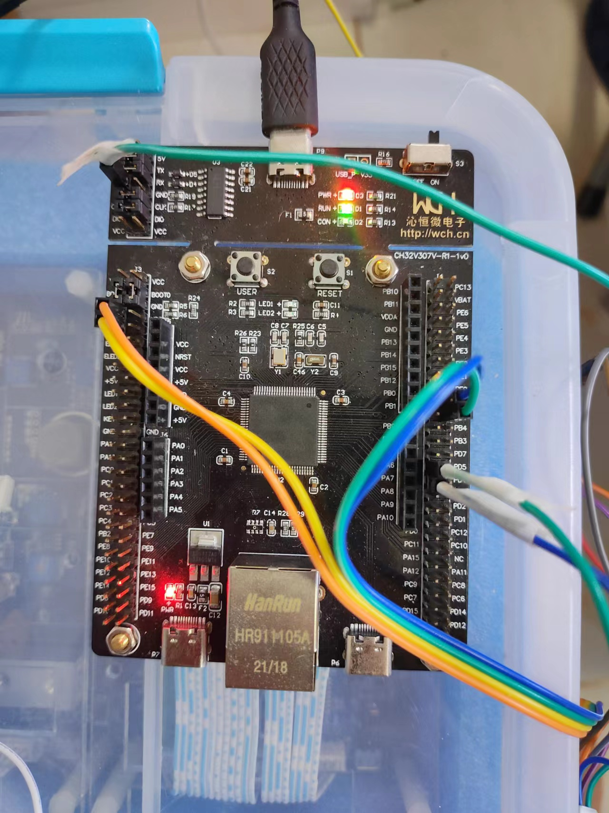

# Rt-thread Summer Camp is based on CH32V307V

## 作品名称：两轴机械臂

### 开发背景

掌握C51，STM32基本知识，进行了一周RT-Thread夏令营学习，未使用过CH32V307V开发板，了解6050，舵机原理。

### 实现功能

舵机自动转动到和mpu角度相同位置。

### RT-Thread使用情况


### 软件包


### 硬件模块


CH32V307V-R1 是 WCH 推出的一款基于 RISC-V 内核的开发板，最高主频为 144Mhz。


MPU6050是InvenSense公司推出的全球首款整合性6轴运动处理组件，内带3轴陀螺仪和3轴加速度传感器。


LD-27MG，20KG，270度单轴数字舵机。

### 硬件引脚连接如下所示


### 软件框架


### 主函数部分

```c
int main(void)
{
    static rt_thread_t tid_6050 = RT_NULL, tid_25mg = RT_NULL;

    rt_kprintf("MCU: CH32V307\n");
	rt_kprintf("SysClk: %dHz\n",SystemCoreClock);
    rt_kprintf("www.wch.cn\n");

    dynamic_sem = rt_sem_create("dsem", 1, RT_IPC_FLAG_PRIO);

    tid_6050 = rt_thread_create("thread_6050", thread_6050_entry, RT_NULL,
                            1024, 25, THREAD_TIMESLICE);
    tid_25mg = rt_thread_create("thread_25mg", thread_25mg_entry, RT_NULL,
                            1024, 25, THREAD_TIMESLICE);

    /* 如果获得线程控制块，启动这个线程 */
    if (tid_6050 != RT_NULL)
    {
        rt_thread_startup(tid_6050);
        rt_kprintf("thread_6050 open success");
    }
    else
        rt_kprintf("thread_6050 open fail");

    if (tid_25mg != RT_NULL)
        rt_thread_startup(tid_25mg);
    else
        rt_kprintf("thread_25mg open fail");
}
```

### MPU6050滤波

```c
void Kalman_get_value(struct mpu6xxx_device *dev, struct IMU_Parameter *IMU_Data)
{
    struct mpu6xxx_3axes accel, gyro;
    mpu6xxx_get_accel(dev, &accel);
    mpu6xxx_get_gyro(dev, &gyro);

    IMU_Data->Accel_X = accel.x;
    IMU_Data->Accel_Y = accel.y;
    IMU_Data->Accel_Z = accel.z;
    IMU_Data->Gyro_X = gyro.x;
    IMU_Data->Gyro_Y = gyro.y;
    IMU_Data->Gyro_Z = gyro.z;

    MPU6050_Read_All(IMU_Data);
}
```

### 信号量获取

```c
result = rt_sem_trytake(dynamic_sem);
```

### 占空比计算

```c
i1 = 1500 + ((2000 * IMU_Data1.KalmanAngleX) / 270);
if(i1>2500)i1=2500;
if(i1<500)i1=500;
if(IMU_Data1.KalmanAngleX < 15 && IMU_Data1.KalmanAngleX > -15)
    i1 = 1500;
i2 = 1500 + ((2000 * IMU_Data1.KalmanAngleY) / 270);
if(i2>2500)i2=2500;
if(i2<500)i2=500;
if(IMU_Data1.KalmanAngleY < 15 && IMU_Data1.KalmanAngleY > -15)
    i2 = 1500;
```

### 舵机控制

```c
if (result == RT_EOK &&
(IMU_Data1.KalmanAngleX == IMU_Data2.KalmanAngleX) &&
(IMU_Data1.KalmanAngleY == IMU_Data2.KalmanAngleY))
//判断是否滤波结束
{
	LD_25MG_set(i1, i2, pwm_dev_level, pwm_dev_vertical);
}
```

### 信号量释放

```c
rt_thread_mdelay(1000);
rt_sem_release(dynamic_sem);
```

### 项目结果


